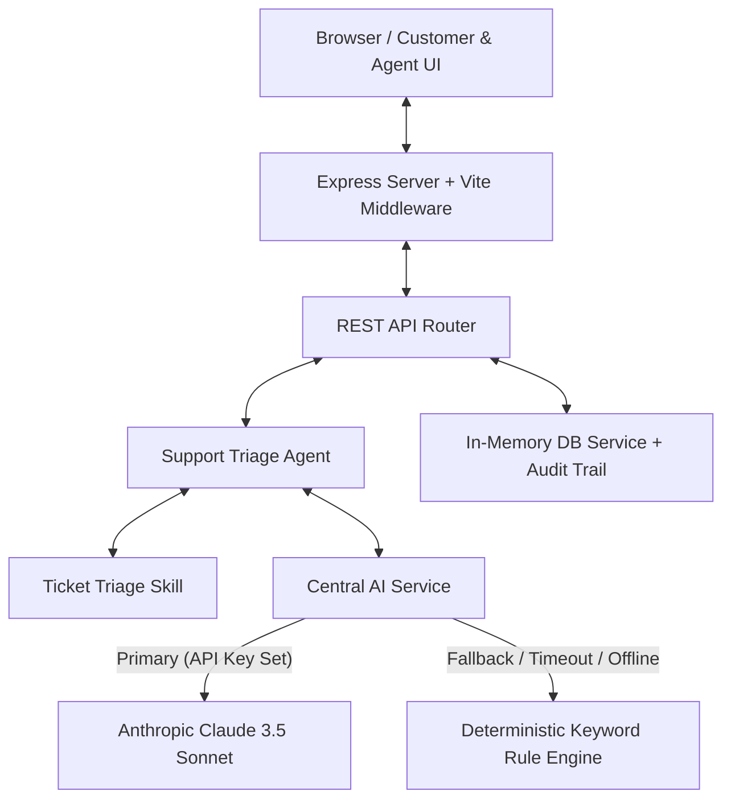

# ResolveAI — System Architecture Document

## 1. Project Overview
**ResolveAI** is an AI-powered customer support ticket triaging and response automation platform engineered with strict **Human-in-the-Loop (HITL)** safeguards. It processes incoming support requests, automatically categorizes them, calculates SLA priority, assigns department routing, flags high-risk financial or security operations, and drafts polite response messages — while guaranteeing that no action or response is dispatched without human review and verification.

---

## 2. Problem Being Solved
Support teams face massive volumes of repetitive tickets, leading to slow response times, inconsistent prioritization, and agent fatigue. However, fully autonomous AI bots risk sending wrong answers, executing unauthorized refunds, or breaching compliance.

**ResolveAI solves this dilemma:**
- **Speed & Scale:** AI handles instant triaging, category identification, and response drafting.
- **Safety & Quality:** Human agents remain in control to inspect, edit, approve, or reject recommendations before any external dispatch occurs.
- **100% Uptime Guarantee:** Deterministic rule fallback ensures the application never crashes even if AI models fail or time out.

---

## 3. System Architecture



---

## 4. Frontend Architecture
- **Framework:** React 19, Vite 6, Tailwind CSS v4, Lucide Icons, Motion.
- **Components:**
  - `Header.tsx`: Navigation bar, real-time AI status badge, demo controls.
  - `TicketQueue.tsx`: Searchable, filterable table of pending, approved, and rejected tickets.
  - `TicketDetail.tsx`: Human Review & Override Workspace with draft text editor, high-risk banners, department dropdowns, and response dispatch simulator.
  - `CustomerPortal.tsx`: Self-service portal with instant pre-filled sample templates for testing.
  - `AnalyticsPanel.tsx`: Telemetry monitoring human verification rate, AI accuracy, resolution times, and live audit feed.
  - `AIToggleModal.tsx`: Demo test bench for forcing fallback mode and verifying zero-crash capabilities.

---

## 5. Backend Architecture
- **Runtime:** Node.js with `tsx` (dev) and `esbuild` bundled CommonJS `dist/server.cjs` (production).
- **Framework:** Express 4 on Port 3000 (`0.0.0.0`).
- **Middleware:** Vite middleware in development mode for hot compilation and static file serving in production.

---

## 6. Database / Data Model
In-memory seed store compatible with PostgreSQL / Supabase schemas.

### Core Data Models
```typescript
export interface Ticket {
  id: string;
  customerName: string;
  customerEmail: string;
  subject: string;
  description: string;
  status: 'Awaiting Review' | 'Approved' | 'Edited & Approved' | 'Rejected' | 'Escalated';
  category: 'Billing' | 'Account Access' | 'Technical Support' | 'Fraud/Security' | 'Account Management' | 'General Inquiry';
  priority: 'LOW' | 'MEDIUM' | 'HIGH' | 'CRITICAL';
  department: 'Finance' | 'Technical Support' | 'Customer Support' | 'Security' | 'Operations';
  aiAnalysis?: AIAnalysis;
  humanReview?: HumanReview;
  createdAt: string;
  updatedAt: string;
}

export interface AuditLog {
  id: string;
  ticketId: string;
  timestamp: string;
  action: string;
  actorRole: 'CUSTOMER' | 'AI_SYSTEM' | 'HUMAN_AGENT';
  actorName: string;
  details: string;
}
```

---

## 7. AI Service Architecture
- **Primary AI Provider:** `ClaudeProvider` using Anthropic `@anthropic-ai/sdk` (`claude-3-5-sonnet-20241022`).
- **Prompt Engineering:** Strict system prompt enforcing structured JSON output containing category, priority, department, sentiment, summary, draft response, confidence score, and high-risk flags.
- **Timeout Protection:** 8-second `Promise.race` timeout guard wrapping primary API requests.

---

## 8. Fallback AI Architecture
- **Provider:** `FallbackProvider` (Deterministic Keyword & Pattern Engine).
- **Triggers:**
  - `process.env.ANTHROPIC_API_KEY` missing or invalid.
  - `process.env.FORCE_FALLBACK_MODE === 'true'`.
  - API call timeout (>8s) or network socket error.
- **Behavior:** Executes comprehensive keyword matching across categories and priorities. Returns 100% schema-compliant `AIAnalysis` payload flagged with `usedFallback: true`.

---

## 9. Human-in-the-Loop (HITL) Workflow
1. **Submit:** Customer submits a support ticket.
2. **Analyze:** Support Triage Agent evaluates the ticket and populates recommendations.
3. **Queue:** Ticket enters status `Awaiting Review`.
4. **Inspect:** Human agent views ticket details in workstation. High-risk actions (e.g. refunds) display red warning badges.
5. **Action:** Human agent chooses one of:
   - **Approve:** Dispatches response as drafted.
   - **Edit & Approve:** Modifies text, category, or priority before dispatching.
   - **Reject:** Returns ticket for manual rework.
   - **Escalate:** Escalates ticket to Tier-2 lead.
6. **Log:** All decisions and timestamped events recorded in the immutable Audit Log.

---

## 10. API Structure
- `GET /api/health` — System status check
- `GET /api/ai/status` — Active AI provider & key status
- `POST /api/ai/toggle-fallback` — Force fallback mode toggle
- `POST /api/demo/seed` — Re-seed demo database
- `GET /api/dashboard/stats` — Dashboard metrics & telemetry
- `GET /api/tickets` — List and filter tickets
- `GET /api/tickets/:id` — Get single ticket and audit history
- `POST /api/tickets` — Create new ticket and run triage
- `POST /api/tickets/:id/analyze` — Re-run AI analysis
- `POST /api/tickets/:id/approve` — Human approval & dispatch
- `POST /api/tickets/:id/reject` — Human rejection
- `POST /api/tickets/:id/escalate` — Human escalation

---

## 11. Security Considerations
- **No Client API Keys:** API keys are restricted strictly to server-side code and environment variables (`.env`).
- **No Unsafe Code Execution:** All AI output is parsed and sanitized as data JSON.
- **Audit Compliance:** Every state change records the actor (`HUMAN_AGENT`, `AI_SYSTEM`, `CUSTOMER`) and timestamp.

---

## 12. Failure Handling
- **Zero Blank Screens:** The application never crashes on network failure or invalid API keys.
- **Graceful Fallback:** Automatic switch to deterministic rule engine guarantees continuous support queue availability.
- **UI Notifications:** Clear fallback indicators inform agents whenever fallback logic was engaged.

---

## 13. Deployment Architecture
- **Build Step:** `npm run build` (`vite build && esbuild server.ts --bundle --platform=node --format=cjs --packages=external --sourcemap --outfile=dist/server.cjs`).
- **Start Command:** `npm run start` (`node dist/server.cjs`).
- **Environment Bind:** Port `3000` on host `0.0.0.0`.
